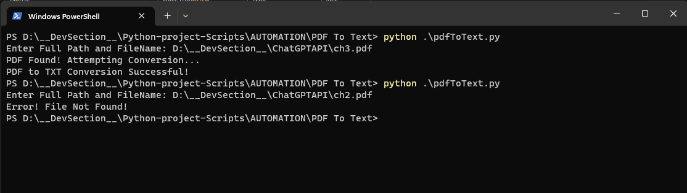

# Extracting Text from PDF using Python 

This project is aimed at extracting text from PDF files using Python.

## Getting Started

These instructions will get you a copy of the project up and running on your local machine for development and testing purposes.

### Prerequisites

Before running the script, you must install the appropriate dependencies. To install these dependencies, run the following command in your terminal.

```bash
pip install -r requirements.txt
```

### Using the Tool

Follow these steps to use the tool:

1. Run the 'pdfToText.py' script:

    ```bash
    python pdfToText.py
    ```

2. When prompted, provide the full path along with the file name of the PDF from which you want to extract text. For example:

    ```bash
    D:\FolderName\FileName.pdf
    ```

3. The data from the PDF will be extracted and stored in a .txt file in the same folder. For example:

    ```bash
    D:\FolderName\FileName.txt
    ```

### Error Handling

If any error is encountered during the process, it will be printed on the screen. For resolution, check the error message and debug accordingly.

Feel free to report any bugs or request features using the issue tracker.

## Example Run and Output

Below is a screenshot demonstrating how to run the commands in the terminal:


