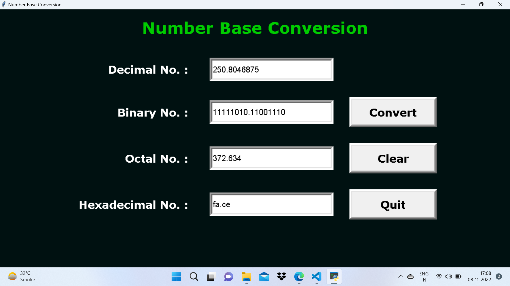

# Number Base Converter

### About

There are various types of number systems in mathematics. The four most common number system types are:
   + Decimal number system (Base- 10)
   + Binary number system (Base- 2)
   + Octal number system (Base-8)
   + Hexadecimal number system (Base- 16)

This program takes input as a number in any one number base system and converts it into the remaining formats.

### Requirements
  + tkinter

### To run this script
python main.py

### Output Screenshot
