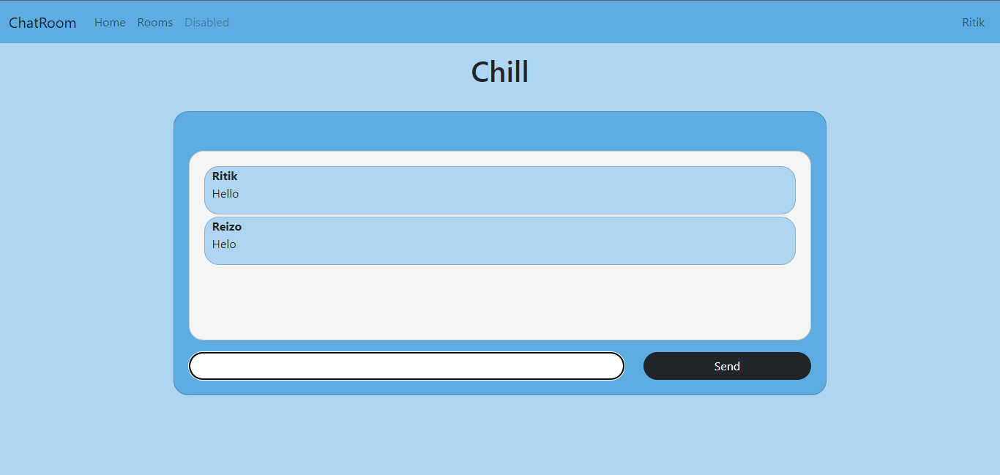

# Django Chat Application 

## Overview

This a simple web application where you can chat in real time. User can send the message to other users available inside the room and read the other's messages. 

You can test it creating two accounts and opening one in browser and other in private browser. Then you will be able to see the messages .

## Libraries and Frameworks Used:
1.Django == 3.0.2
2.django-environ == 4.1.4
3.channels == 3.0.4

## Screenshot

