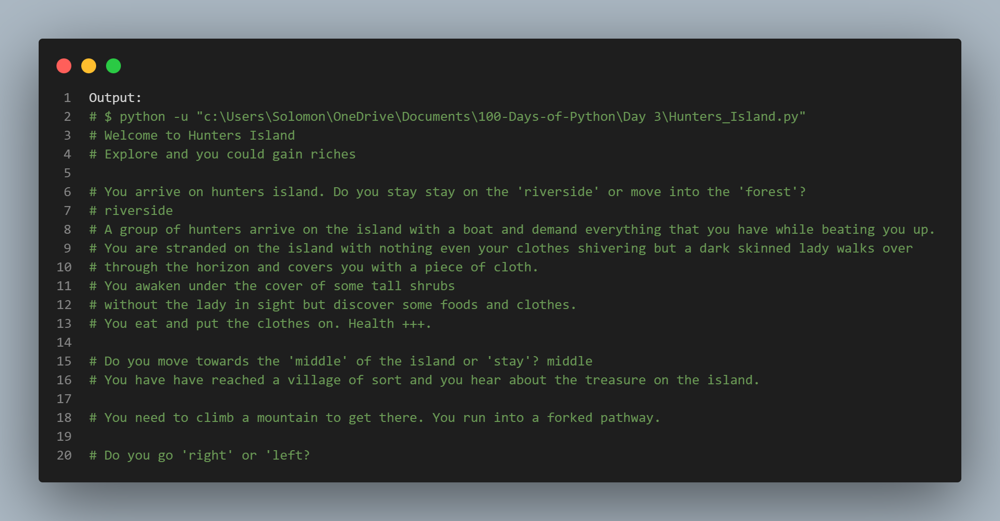

# Title: "Hunters Island Adventure"

### Expected game output on the terminal

## Introduction:
Welcome to "Hunters Island Adventure," an interactive text-based game where you take on the role of a stranded individual on a mysterious island. Your choices will determine your fate, whether you find riches or face peril. This game is all about decision-making, so choose wisely!

### How to Play:

**Start:** `You arrive on Hunters Island. You have two options: "riverside" or "forest." Type your choice, and let the adventure begin!`

**Riverside:**

You stay by the riverside, but a group of hunters arrives on the island, demanding everything you have. They beat you up.
A mysterious lady covers you with a cloth, and you find food and clothes. Your health increases.
Choose between moving to the 'middle' of the island or 'stay.'
Middle of the Island:

You reach a village and learn about the island's treasure.
You face a forked pathway. Choose to go 'right' or 'left.'
Right Path:

You find an ancient castle with three doors: 'modern,' 'scratched,' and 'metal.'
Choose a door, and your fate will be revealed.
Scratched Door:

Congratulations! You found the treasure chest!
Any other door choice:

You face various perils, and the game ends in failure.
Left Path or Any Other Choices:

Different challenges and outcomes await you, potentially leading to failure.

**Forest:**

You enter the forest, avoiding the hunters.
You overhear the hunters talking about a treasure map.
Decide whether to 'steal' the map or head to the 'middle' of the island.
Middle of the Island (same as the Riverside Path):

You reach the village, face a forked pathway, and ultimately discover the treasure's location.

**Conclusion:**

The game has multiple possible endings, depending on your choices.
Make strategic decisions to explore the island, avoid danger, and, hopefully, find the hidden treasure.

**Game Over:**
Be cautious; there are numerous ways for the game to end in failure or even death.
Enjoy your adventure on Hunters Island, and may you uncover the legendary treasure!