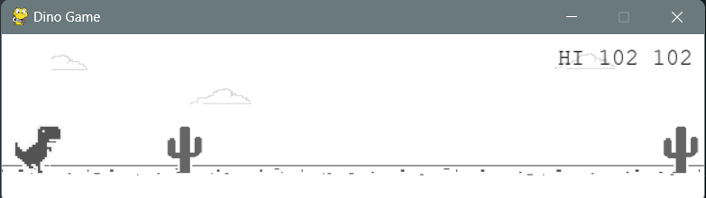
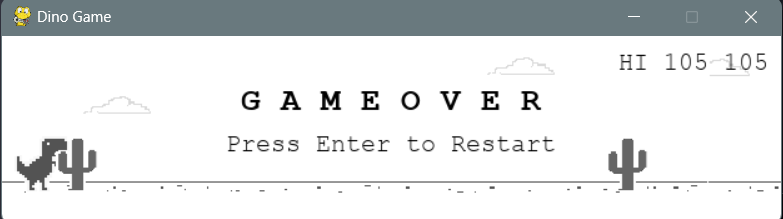

# Dino Game

## Description

Dino Game is a simple yet addictive game built using Python and Pygame library. It's inspired by the classic Chrome Dinosaur game, where the player controls a dinosaur that must jump over obstacles to survive. The game features a dinosaur character, cactus obstacles, and a score system. I have created a simple clone of the game. Feel free to look through the code and run it.

## Features

- Control a dinosaur character to jump over obstacles.
- Dodge incoming cactus obstacles to survive.
- Track and display the player's score as they progress through the game.
- Simple controls: Press the spacebar to make the dinosaur jump.
- Press Enter to restart the game after a game over.

## Installation

1. Ensure you have Python installed on your system. You can download it from [python.org](https://www.python.org/).
2. Clone this repository to your local machine:

```
git clone https://github.com/sahilrw/dino
```

3. Navigate to the project directory:

```
cd dino-game
```

4. Install the required dependencies using pip:

```
pip install pygame
```

## Usage

1. Run the game by executing the following command:

```
python dino.py
```

2. Use the spacebar to make the dinosaur jump over obstacles.
3. Avoid colliding with cactus obstacles to keep the game going.
4. Your score will increase as you progress. Try to beat your high score!
5. If the dinosaur collides with an obstacle, the game will end. Press Enter to restart and play again.

## Screenshots




## Credits

- This game was created by Sahil Wankhade.
