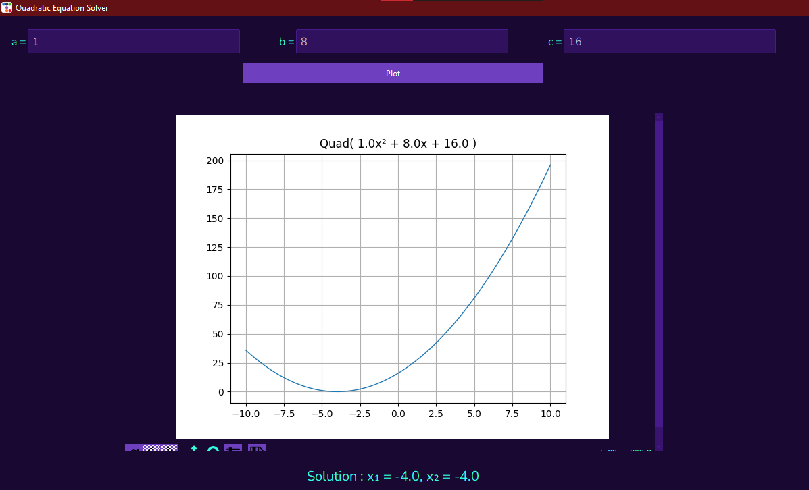

# Quadratic equation solver



## Requirements
```powershell
numpy : 1.24.2
matplotlib : 3.6.3
ttkbootstrap : 1.10.1
tkinter: "inbuilt", 8.6
```

A simple quadratic equation solver with ttkbootstrap as GUI

- A Quadratic class was created to ease GUI use

## `Class Quadratic`
A quadratic class recieves 3 arguments (a,b,c) according to 
ax² + bx + c
```python
q1 = Quadratic(a = 2, b = 4, c = 5)
```
## Methods
### The solve quad method solves a quadratic expression assuming the expression is equal to 0  
 > returns a tuple of two numbers
 ```python
 q1 = Quadratic(a = 1, b = 8, c = 16)
 print(q1.solveQuad())

 # returns 4, 4
 ```
 > Where the determinant is less than zero, a complex number solution is returned `python3 supports complex numbers`

### The evaluate method replaces the x in  ax² + bx + c with an integer or float and returns the calculated value
 ```python
 q1 = Quadratic(a = 1, b = 8, c = 16)
 print(q1.evaluate(value = 2))

 # returns 36
 ```
### The draw figure method draws a quadratic equation graph using numpy and matplotlib 
 > `numpy and matplotlib required` see requirements section above
 ```python
 q1 = Quadratic(a = 1, b = 8, c = 16)
 print(q1.drawFigure())

 # returns 4, 4
 ```
 > A matplotlib figure is  returned and can be added to a matplotlib graph
