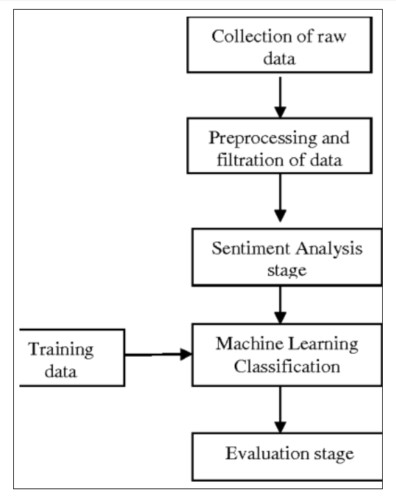
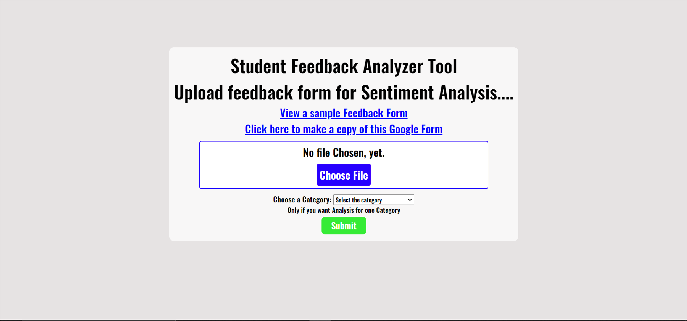
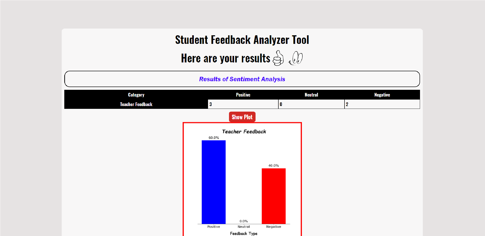

## PROJECT OUTLINE
The goal of this project is to develop an automated robust feedback analysis system wherein the user has to first upload form response data in csv format, then we process and extract the data with the help of NLTK and then applying sentiment analysis using Naive Bayes algorithm to extract the opinions and subjectivity from the student feedback by classifying them into 3 different categories: 
- positive 
- neutral 
- negative

Nowadays, Educational Institutions are giving a lot of emphasis on maintaining Student Feedback Systems so as to understand the patterns generated by student feedback data to effectively improve the performance of the institution. There is also a requirement to automate the student feedback system in order to handle a large amount of data and analyse them effectively.

Our feedback analysis model will thus enable the concerned authorities to understand the student’s  perception and their expected level of learning materials and course content. Analysing student feedback would help institutions to enhance student’s learning capabilities in the classroom and improve the overall quality of education.

## WEBSITE LINK
_https://get-analysis.herokuapp.com/_

## DEMO OF WORKING MODEL 
_[Project Demo](https://drive.google.com/file/d/1hAu_Rmdu8qq6yjq8DSgD-P08EA4nTuVu/view?usp=sharing)_ 

 

## PROJECT WORKFLOW

 

## RESULTS

 

## WEBSITE LAYOUT

