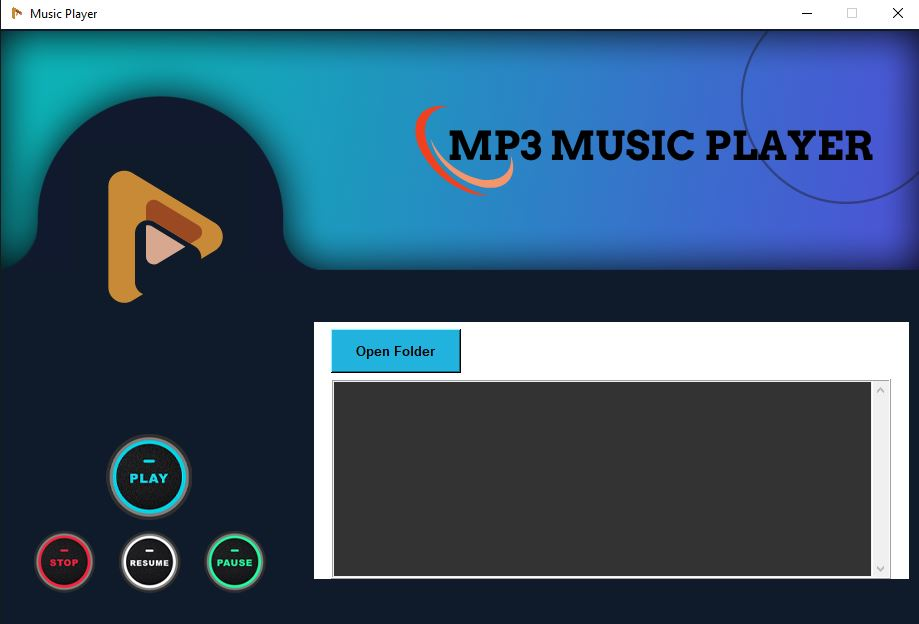

# Creating a mp3 Music App Using Python

Some of the common fetures of a music player include:

-   Open music files,
-   Play music,
-   Pause music,
-   Unpause,
-   Stop music just to mention some of the common features.

The good news is, you can achieve all this with Python and with the help of some libraries. Now, it’s time to implement the above mentioned features.

## Expected Output

The following image shows the output of the app.

and below is after adding some music to the app.

