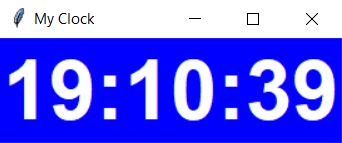

## Digital Clock with Tkinter

A digital clock using python and the Tkinter library.

### Code
A Clock class is created, with two instance method, one
for setting purposes (in this case to set the name of the clock),
and the `widgets` method, which holds the actual business logic.
This method uses a nested method that is responsible for
setting the current time and start counting from it.\
The Clock will have a random color.

### Sample clock:

